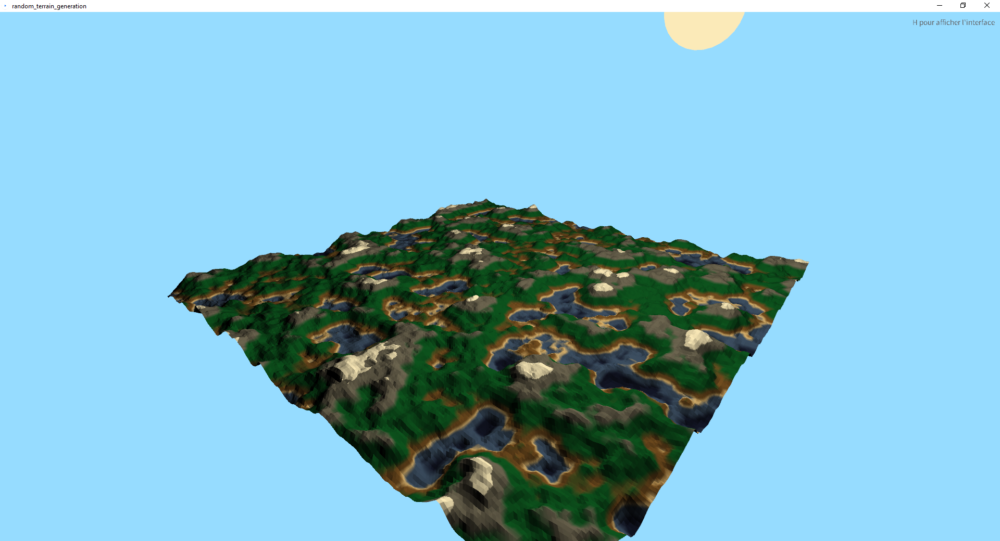
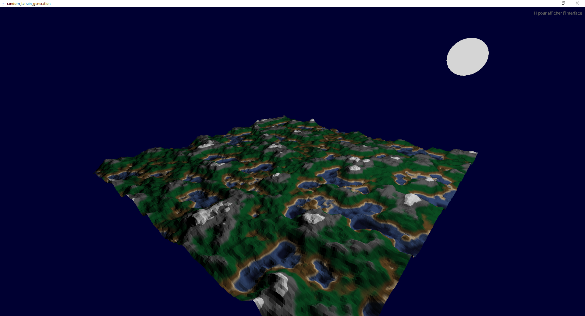

# Projet Génération Terrain Aléatoire

Ce projet a été fait dans le cadre du cours d'ISIR (Introduction à la synthèse d'Images Réalistes) et de la partie proposée par M. TERRAZ Olivier (https://www.xlim.fr/personnel/terraz-olivier) sur la représentation d'objets, en première année du Master ISICG à l'université de Limoges.

Le projet a été réalisé par RICOU Julie (https://github.com/DreamDreamy) et MARCHAND Célestin (https://github.com/Romecyti).

Il s'agissait de faire une génération de terrain aléatoire, en temps réel avec un déplacement, représenté par une structure basée sur les cartes topologiques généralisées (https://en.wikipedia.org/wiki/Generalized_map).
La génération est basée sur le code proposé par **The Coding Train** (https://www.youtube.com/@TheCodingTrain) dans sa vidéo youtube sur la génération de terrain : https://www.youtube.com/watch?v=IKB1hWWedMk.

# Illustration
En ajout, et pour avoir un rendu plus visuel, nous avons fait un mapping des hauteurs des sommets de la cartes sur un ensemble de couleurs et avons ajouté un cycle jour/nuit.

---

***Image le jour***

---

***Image la nuit***

